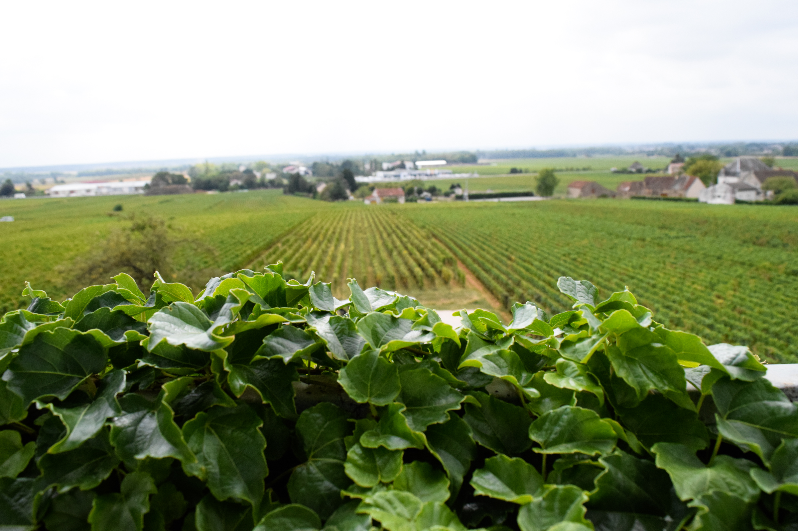
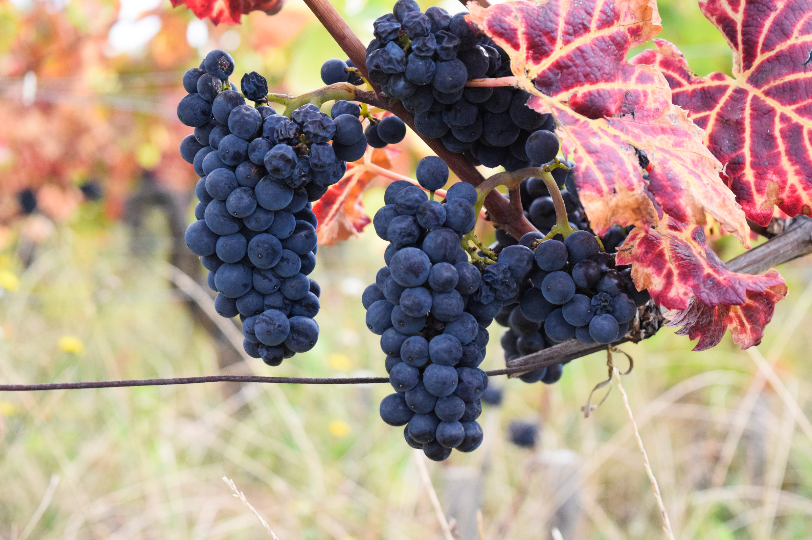
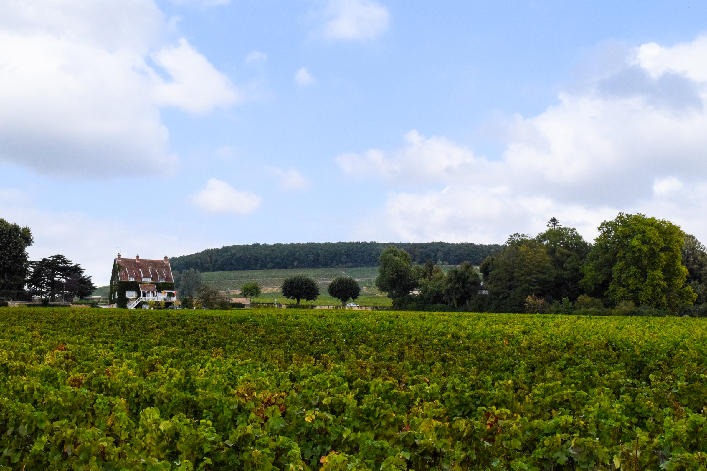
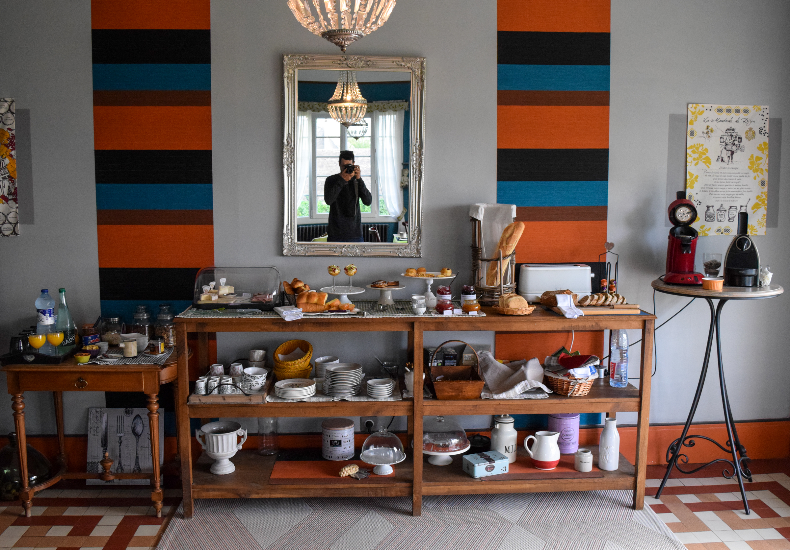
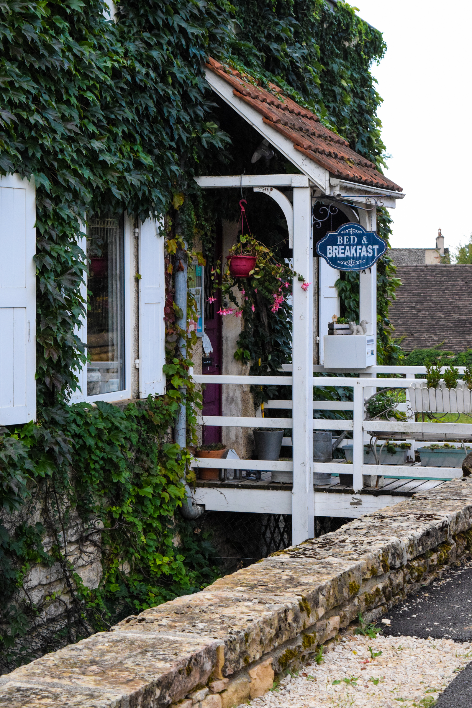
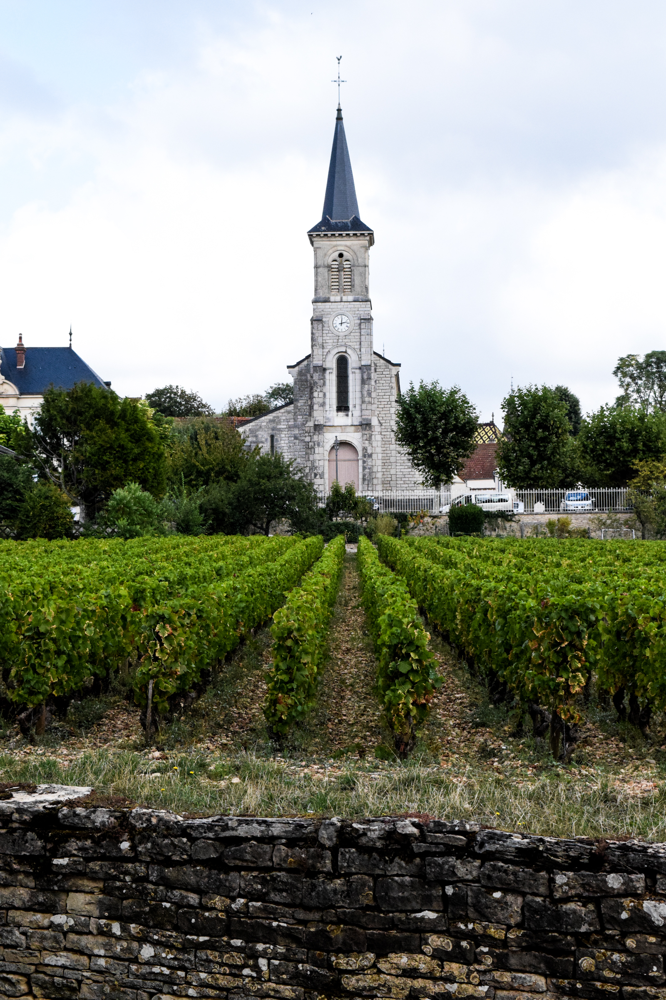
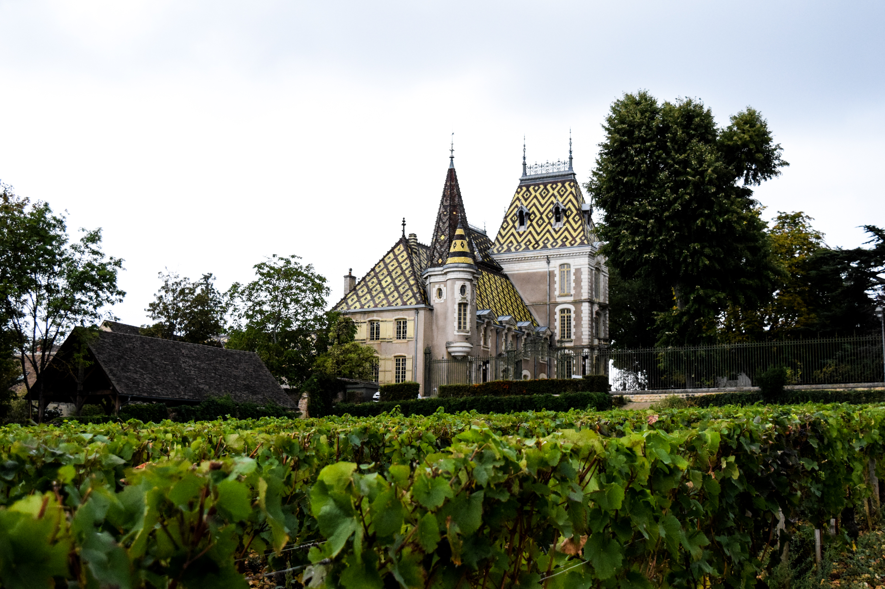

We are on day 3 of our Europe trip, and we are still at our first stop in a *very* small village in Burgundy called Aloxe-Corton. It is a 10 minute drive from the large-ish town of Beaune and surrounded by vineyards. 

There is no grocery store or restaurant in the town. Just many, many vineyards and a couple places to stay. We settled in a gorgeous B&B with the nicest owners.

We are not very wine savvy, so much of the uniqueness of this area is probably wasted on us. However, the physical landscape, the small villages and the old buildings all combine to make a countryside that is *unbelievable*. We have spent the majority of our time biking through vineyards and walking through town.

We've also done two tastings. For the first one, we tried 3 wines in a Chateau. The manager did not know English so we drank wine and looked around. The second tasting was the best education we have ever received in wine (yes, including the few tastings we had in Napa). It was very approachable and got both me and Em really motivated to appreciate wine more.

* Here's some simple lessons we learned in the short tasting that I think we will actually remember years from now. Let's call it, Matt and Em's new dummies guide for wine. I'm sure we will revise it as we learn more.

  * If you want to pair red wine with food, an easy way to do so is to open the bottle, taste it, think of what food comes to mind, and then go and make that food. So, if the wine     reminds you of earthy flavors, then maybe go make something with mushrooms. This is a     culinary adventure we'd like to try when we get home (or maybe while we're here).
  * Wine has been made in the Burgundy region as far back as Roman times[1](#footnote1). That's 400 BC. I'm sure there are other areas in the world with similar rich histories. With that in mind, give a nice wine a little bit of reverence even if you think it's wasted on you. That means, learn a little bit about where it's from and what grapes were used and take your time with drinking so that you can taste as many flavors as you can.
  * To do a wine tasting without feeling like an idiot, (1) smell the wine, (2) swirl and smell again, (3) take the first (small) sip and let it fill every corner of your mouth to cleanse your palette, (4) continue to take sips until the wine is gone. (At least, that's what the lady told us to do! Oh, and we didn't spit because we feel weird doing that).

<a name="footnote1">1</a>: There are only two grapes produced in this region - Pinot Noir and Chardonnay - and there are no blends. With the same weather and grapes, there is an official scale for quality that is determined by the soil alone. It was determined in the 1930's and has not changed. There are four levels with the highest called "Grand Cru". That soil makes up 1% of the soil in the Burgundy region. 