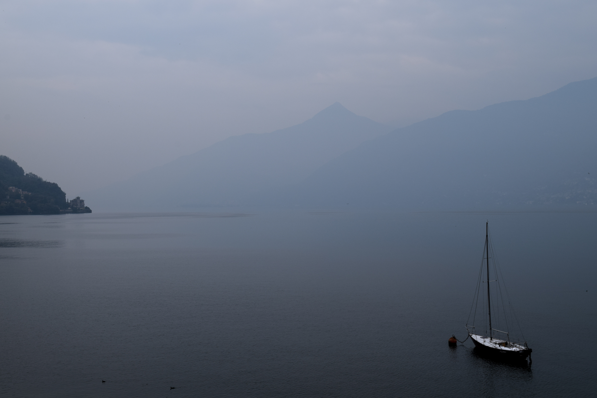
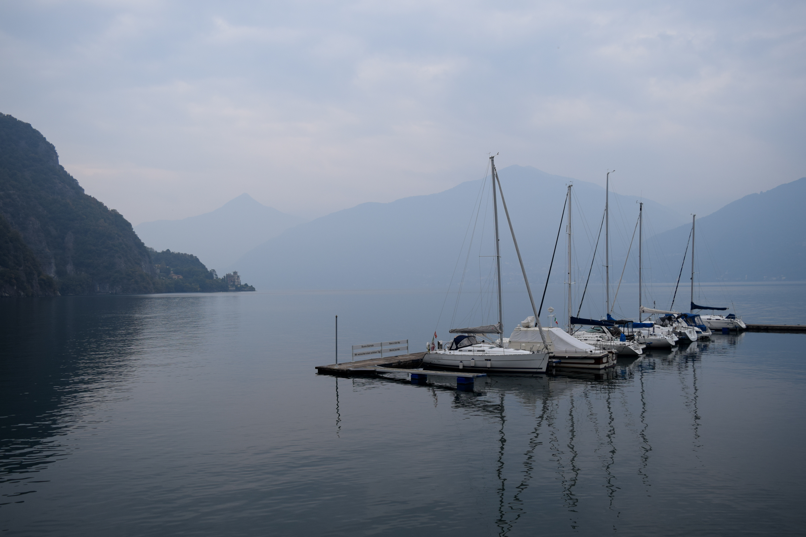
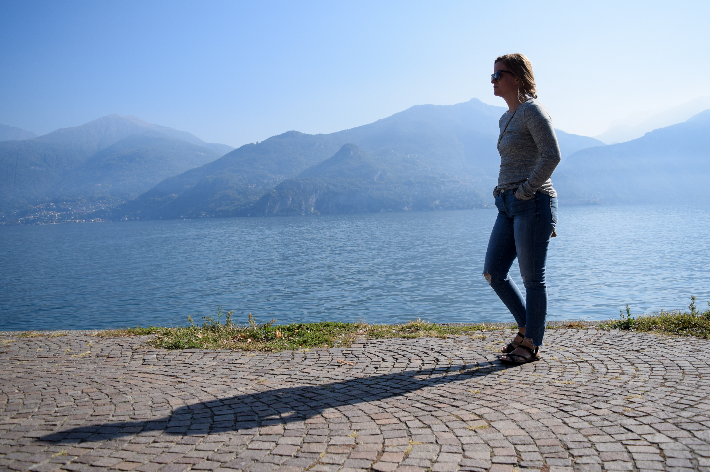
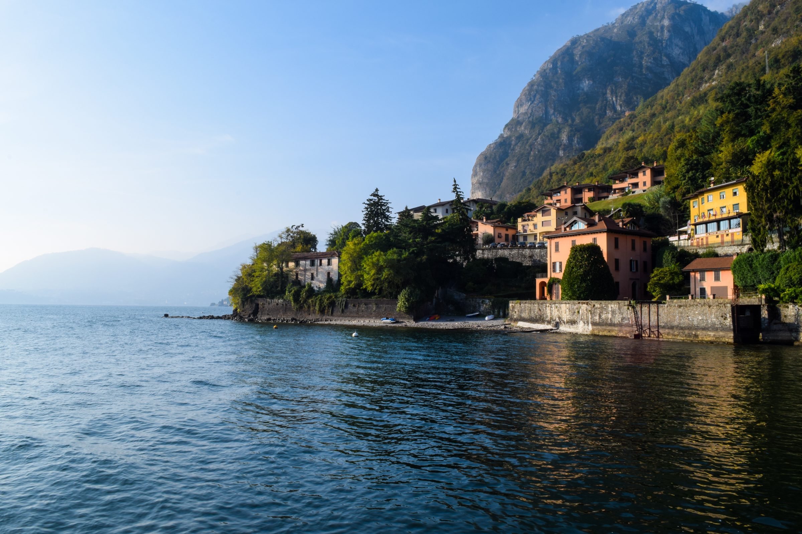
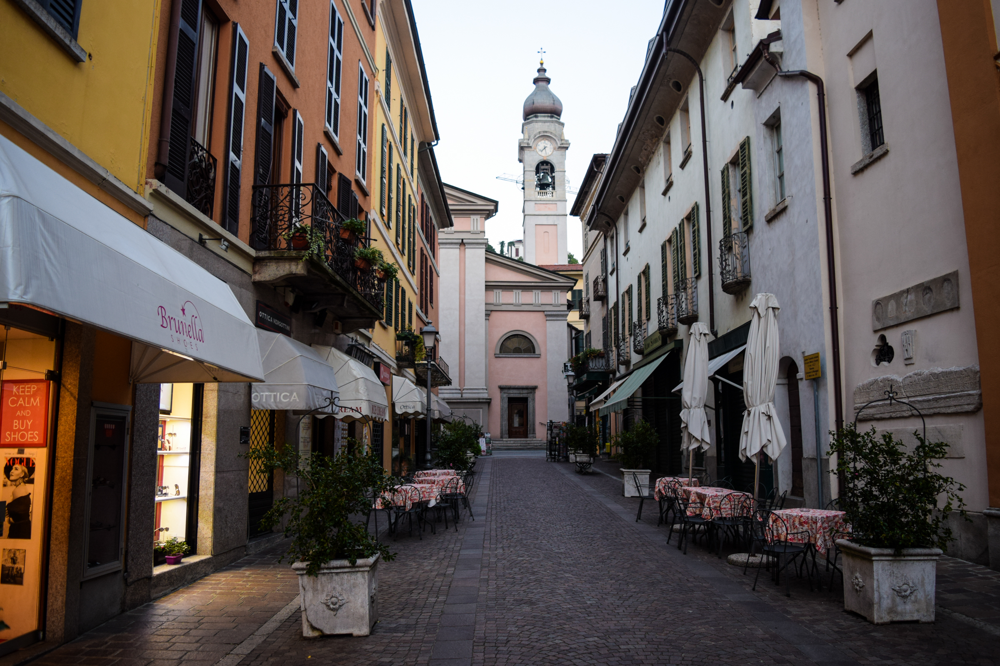
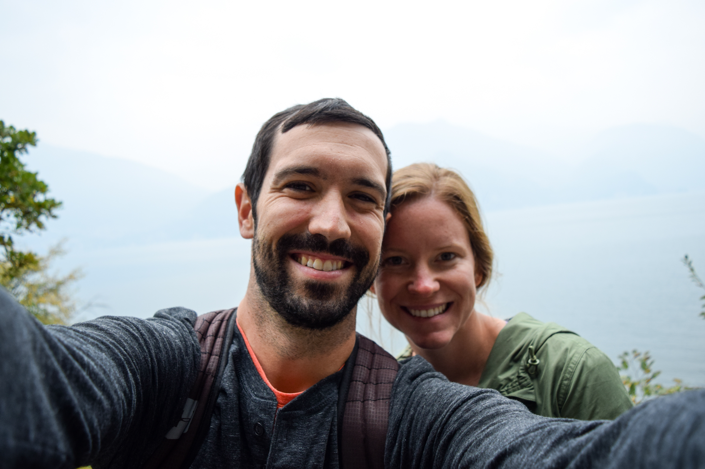
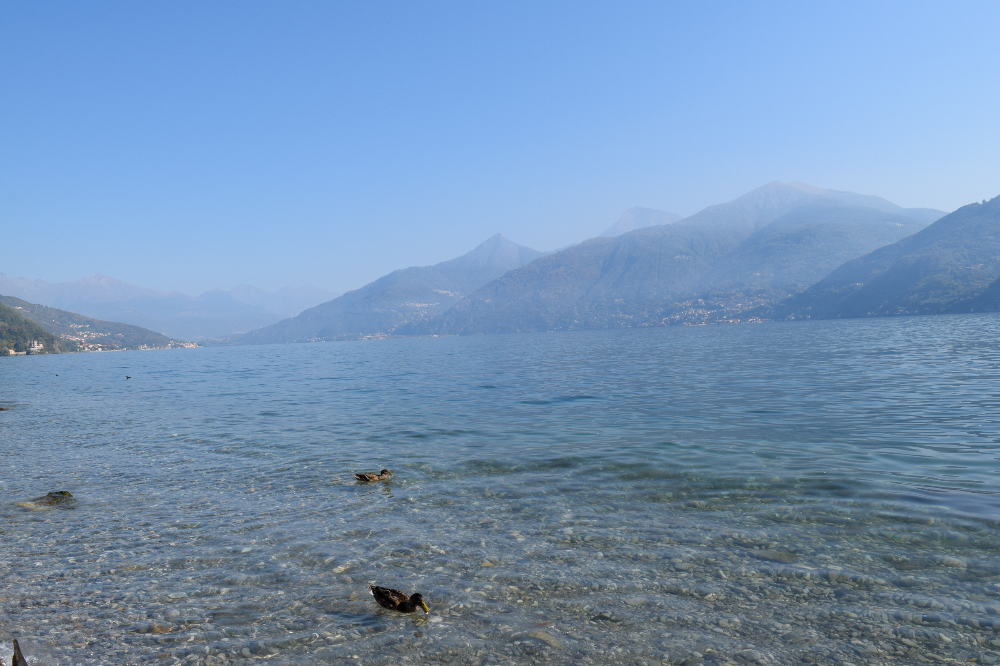
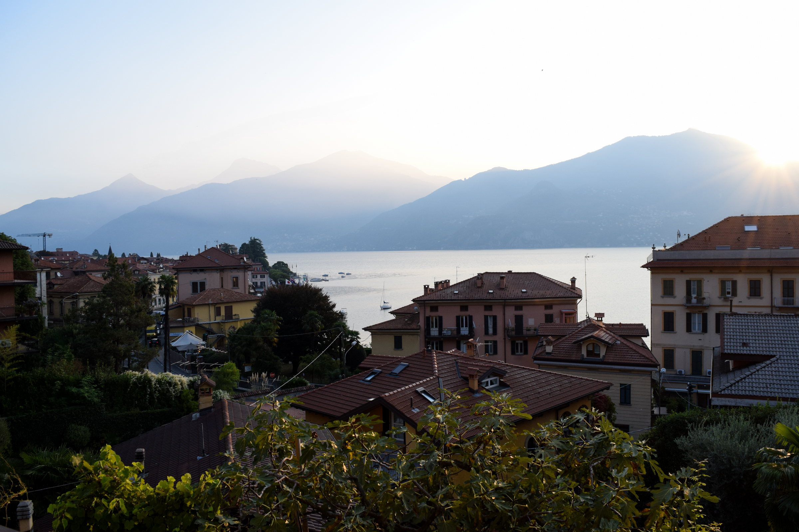

We just spent the last 3 days in a small town on Lake Como in Italy, called Menaggio, and all we can think about is how we would have liked to stay longer. This is probably the most beautiful place we have seen so far, with clear lake surrounded by mountain ranges for miles. 

The town of Menaggio itself is the perfect size, large enough to have it's own ferry, about 10 bars, two churches, a few restaurants, a grocery store, some specialty shops, and even a mini-golf course. 

We have travelled to other towns in the past that are just too quiet to stay in for a long span, including Aloxe-Corton in Burgundy and Praiano on the Amalfi Coast. But Menaggio is well connected to the rest of Lake Como by road, ferry, and some amazing walking and biking paths. 

We started to picture a longer stay here where we could go for long runs in the mornings and spend our afternoons cooking, reading and eating on the balcony. We even got into a little routine in the few days we spent here, cooking pasta each night and observing happy hour on the balcony religiously.

But now we must move on to new horizons. Lake Como is the pefect halfway point between Tuscany and Switzerland, and we are scheduled to catch the Bernina Express and make our way to the Swiss Alps. 