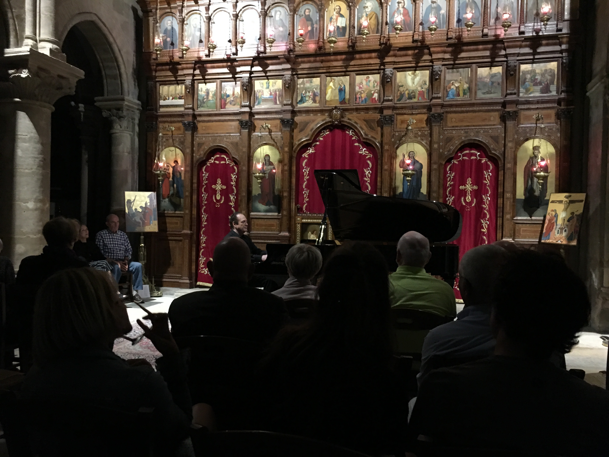

At the advice of some friends, we spent the majority of our France trip in Paris - 6 days. Everyone told us that we would not run out of things to do there and they were right. The city reminds me of Rome - with it's regal apartments and the way that the modern world mixes seamlessely with various historical periods - but larger. 

In fact, we sort of made a mistake by treating it like Rome. In Rome, you could walk to the Pantheon, Spanish Steps, Piazza Navona, Vatican, Borghese Gardens all in a day, but when we tried to mix a few sites in Paris we ended up spending a lot of time just walking. This is a minor thing to complain about though, when you can walk along the gorgeous Seine and stop anywhere for beer. 

We played the role of the typical tourist and crammed a lot of sites into just a few days, including 2 days with the Paris museum pass in which we went to Saint Chapelle, the Concierge, the Pantheon, the Louvre and Versailles.

In the past, we used to go to tourist attractions and learn virtually nothing, being too cheap to get a personal guide or pay for an audio guide. This time around, we discovered the free walking tour app by Rick Steves. For the most part, we really enjoyed these. Despite the fact that Rick Steves is probably the cheesiest guy in the world, his app gives you good background of the most popular sites while allowing you to explore at your own pace. 

We also spent some time doing some more unique things that really paid off. We saw an advertisement for a piano concert in the oldest church in Paris, St. Julien le Pauvre, and decided to go that very night. The program consisted of popular Beethoven Sonatas and Chopin pieces, including some of Matt's favorites. It was an evening of very beautiful music in an intimate setting for a very good price. 

One of our favorite things we did was to picnic under the Eiffel Tower at night. It worked out well because Matt got his piano concert and Em got her picnic. We got some meat, cheese, bread and wine and laid down a little tarp we bought in Maine to use at the beach. We even listened to another Rick Steves audio explanation of the building of the tower while we waited for the lights. 

Although it may seem cliche, we simply couldn't stop taking photos of the Eiffel Tower. It's modern design really leaps out of the Parisian landscape and provides an amazing focal point.

