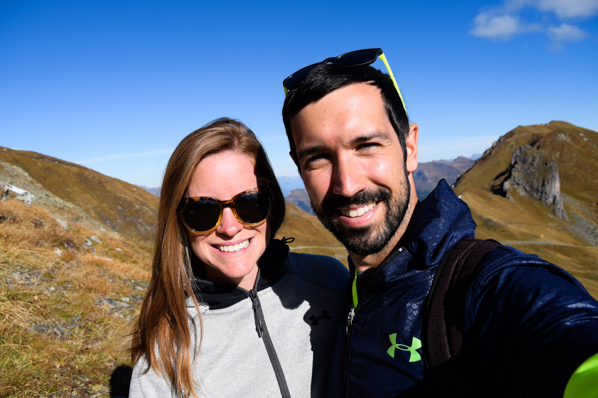

Em and I always knew we wanted to go to Switzerland, but it was challenging to connect it with our plans in Italy and Germany. There's two things we've always talked about doing, sort of like bucket list items if you will - ride the Bernina Express and hike in the Alps.

We spent just enough time in Switzerland to do both of these, which was a good idea since we would have gone broke if we stayed any longer. Wow, Switzerland is expensive. Food prices were definitely a shock after coming from Italy. When we arrived in the train station in Chur, we saw a small pizza slice for 8.50 CHF, which would have been something lke 2.50 Euros in Italy. 

It was all worth it, though. The Bernina express is a 4 hour train that goes from Tirano in Northern Italy, through the Berning Pass in the Alps and into Switzerland. The winding road is full of mountain lakes, green fields, and snow capped mountains. 

The train ends in Chur, and we had a lot of trouble finding a place to stay there. We decided instead to take another hour long train through the mountains to the Ski Resort town of Arosa. This turned out to be a great decision, and was probably the first place that we went to on our trip where we did not see any other English Speaking tourists. 

We stayed in a cozy ski-lodge type of hotel called Hotel Stoffel. THe staff was really helpful, the place was perfectly cozy, and the hiking paths started right outside the door. 

We decided to take the ski lift up to the top of the mountain and hike down. I don't think we've ever seen such a stunning landscape. By the end of the day, we were really glad to have made the stop in Arosa.

 
