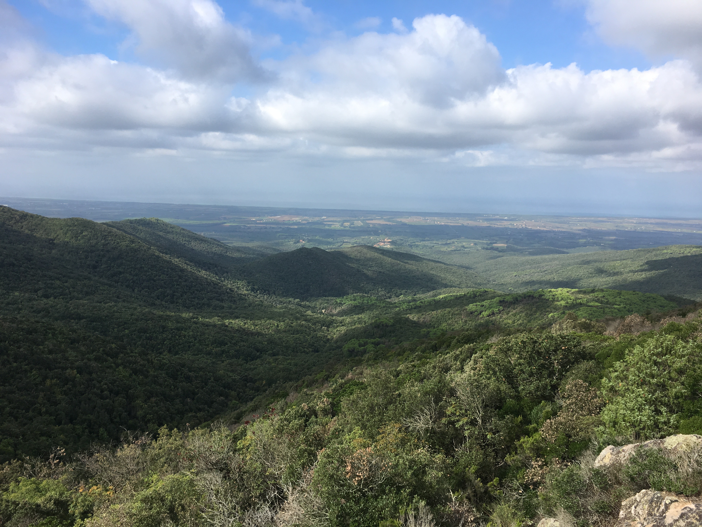

Today our wondeful host invited us to join her local "walking group" on their weekly hike. The group had a meeting in the beginning of the year where they voted on a list of hikes. This has led to a schedule where they go to a different place in the area every week, excluding the hottest months of the year - so, let's guess around 40 different hikes.

Are you struck by a new thought? I was. You never think of tuscany as a place to hike. Every picture you see on the internet or in the movies is of rolling hills full of private vineyards and Tuscan farm houses, but Tuscany has tons of forest. 

We set out with a group of 15 people - 3 Germans, 6 Italians, and your 2 favorite Americans - to cover a total of 14km. This took us roughly 6 hours and was way more intense than I expected. The terrain was challenging with rocky ground, narrow paths, and lots of brush and elevation. We saw signs of wild boars, and a couple mushrooms, which the Italians go crazy for including Porcini. One of the group members described a mushroom she picked that was large enough that she sliced it and cooked it as if it were a steak.

We stopped twice to picnic, but we tried to show no signs of exhuastion since we were the youngest participants. In fact, there was an 82 year old Italian woman ahead of us most of the time, trudging along and making it look easy.

Although I tried to speak some Italian, I really need to work on my listening skills, and it was broken at best. Everyone was very kind, but our host was the only participant that could speak to everyone since she is fully fluent in English, German and Italian[1](#footnote1). Em and I were in awe watching her switch constantly between the three languages. Every now and then, she would turn to us to ask us a question or make a comment, but accidentally start off in German or Italian. 

The views were amazing, it was a good workout, and we got a little glimpse into a lifestyle and people whose lives are very different from ours. All in all, a good day.

<a name="footnote1">1</a>: Our hosts speak, German, Italian, English and French effortlessley. It makes me really motiviated to try and brush up on my Italian skills and find a way to stay consistent with my learning.

 