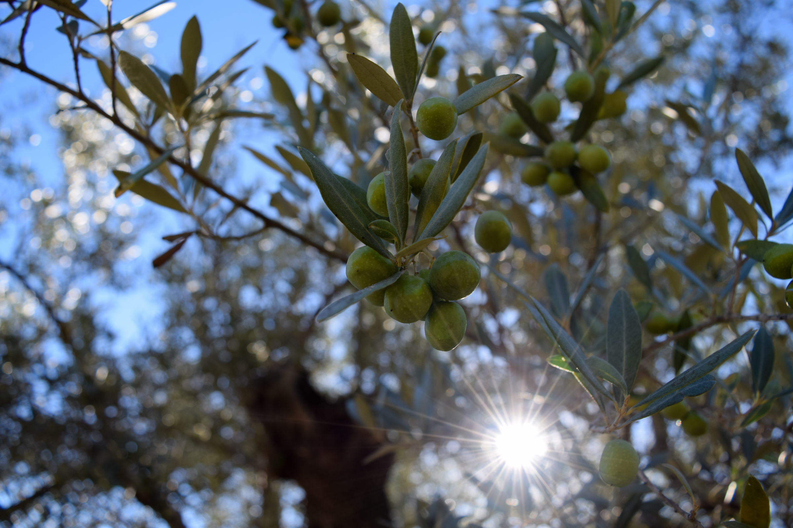
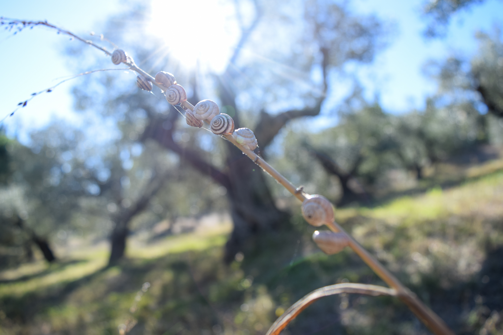
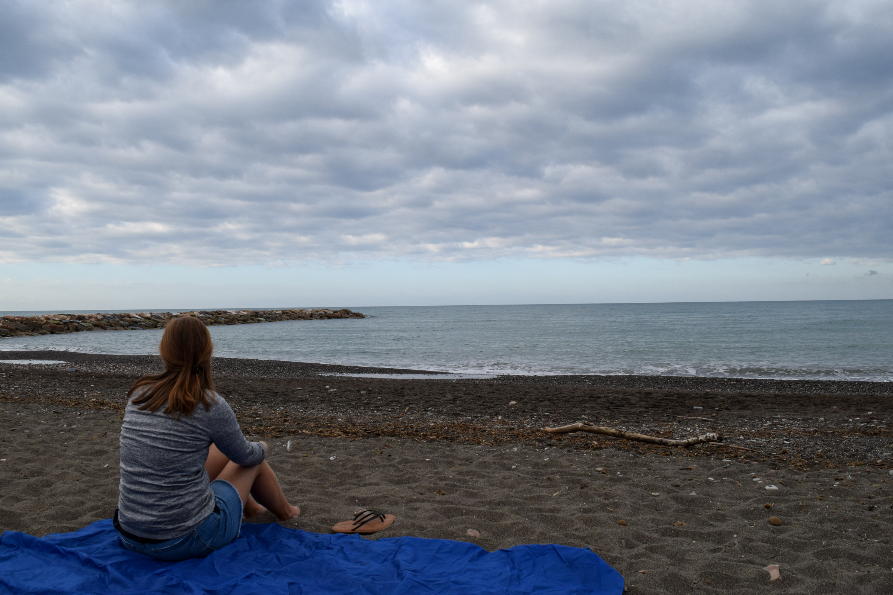
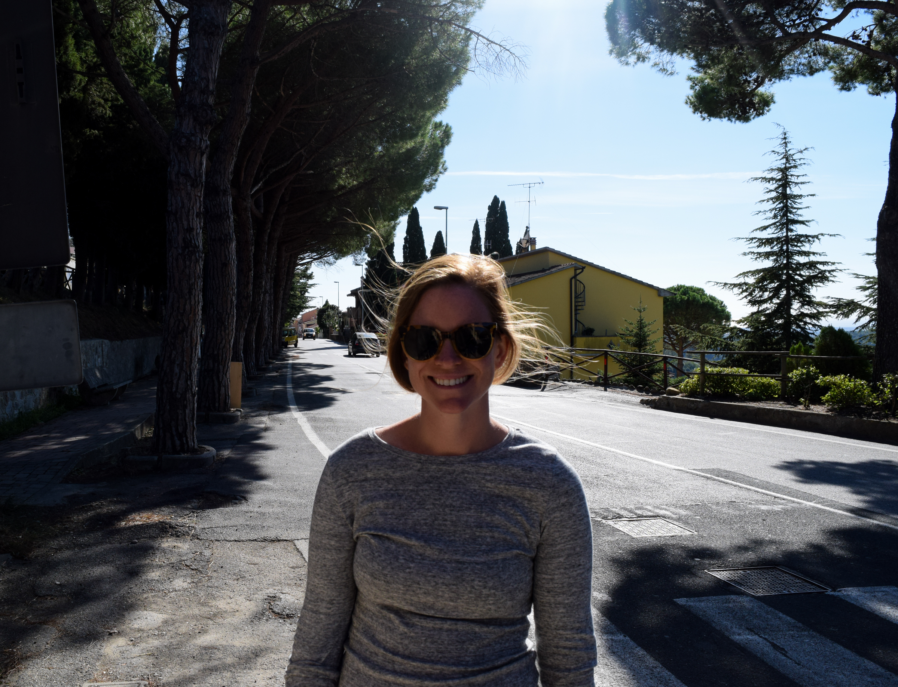
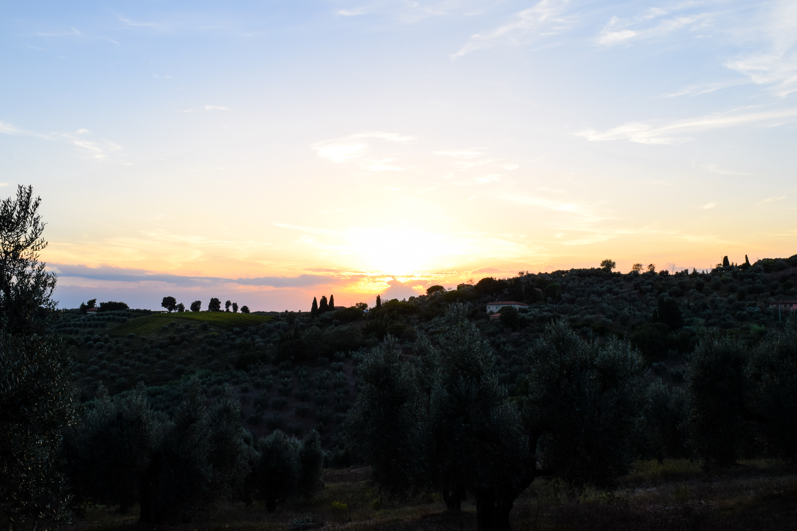

We recently finished a 10 day stay on a farm in tuscany, our longest stop on the trip. There, we were volunteering on an olive farm in exchange for room and board. It's an experience made possible by an organization called WWOOF, Worldwide Organization of Organic Farming.

To most people, the idea probably sounds a little quirky. The experience is not really regulated at all, as the WWOOF organization mostly just connects workers with farms and provides a bare minimum of liability protection. But funnily enough, it's something that Em and I talked about on our first date. Before dinner even started, she mentioned how she wanted to travel, and that one expereince she was really interested in was WWOOFING. I had just WWOOFed for the first time a couple years before. She was the first person I had ever met who had the same interest, but at that moment, I defintely did not think we would be spending our first wedding anniversary on a farm together!

We were really hoping to participate in the olive harvest, but our trip was too early for it, so our work mostly involved clearing land between olive trees and pulling the many shoots that grow at the bottom of the trees. The farm has 500 trees, so there was more than enough work on that front. We were only asked to work 4 hours a day, but we were exhausted. The landscape is so stunning though, it's hard not to enjoy it. 

The best part of our stay was our hosts. They are an older German couple that moved into Tuscany 40 years ago after working in Africa for some years before that. I think what we enjoyed most was just being able to become part of their routine. We shared in all of their meals, went shopping with them, worked with them out in the olive grove, etc.

* Here is a typical day at the farm:

* 8 AM: Breakfast with our hosts in the kitchen
* 9:30 AM: Work in the olive grove
* 1 PM: Lunch on the terrace
* 2 PM: Hang out in our apartment, nap, read, play cards
* 7 PM: Watch the sunset
* 7:30 PM: Dinner on the terrace with wine from the vineyard
* 9 PM: Watch Friends in our bed (guilty travel pleasure) and fall asleep

This schedule changed around a little bit. There were two mornings where we went running / swimming with our hosts in the morning and worked in the afternoon instead, and Sundays were free for us. We also went into town a couple times, which can be reached through an hour long hike in the woods.

However, even when things changed around, there was always a sort of rhythm to each day that was very comfortable. Our hosts do not rush, and they do not try to do too much in one day. They take their time for meals, for reading, and other activities, but still get a lot of work done. It's a life with little distraction, and it was a nice change of pace for us. I remember telling Em before we got to the farm that I was worried I wouldn't be able to relax and that I would feel bottled up in such an isolated place. We had just come from 6 days in Paris running around like crazy people and we had so much of our trip still to plan. This fear completely dissapeared within a day and, at times, it was like the outside world didn't exist. 

* By the way, for those of you who'd like to follow our rummy game, here's the scoreboard. 

* Em - 2,690
* Matt - 2,545

